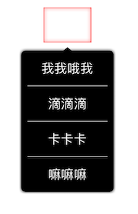
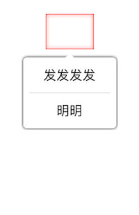

### LYPopoverView

### Usage
---

~~~swift
let popverView = LYPopoverView.init(frame: CGRect.init(x: 0, y: 0, width:LYPopoverViewWidth , height: 0), titles:["test", "test1", "标签"])
view.addSubview(popoverView)
popverView.showFromRect(rect: CGRect(origin: CGPoint(x: 100, y: 50), size: .zero))

~~~